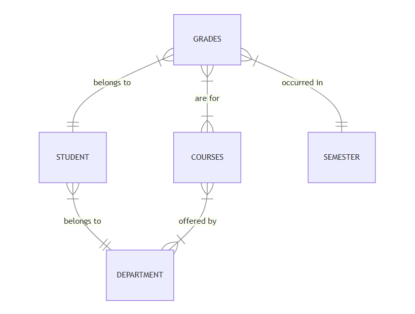

# Design Document

By THOMAS SASIKANTH SINGADI

Video overview: <https://youtu.be/alMpq24ZofU>

## Scope

The main purpose of this database is to store all the information of each and every student's grades obtained in every semester.
Based on the grades it is easy to calculate SGPA and CGPA of each and every student in every semester. It helps a lot to the universities or colleges to track their student's scores in terms of grade points. The database includes all entities necessary to facilitate the process of tracking grades of the students. As such, included in the database's scope is:

* student, including basic identifying information of the student
* department, including basic identifying information of the department
* semester, including basic identifying information of the semester that the student is studying in
* courses, including basic identifying information of the courses in each semester
* grades, including basic identifying information of the grades obtained by each and every student.

Out of scope are elements like instructors, university or college related attributes.

## Functional Requirements

This database will support:

* CRUD operations for student and grades
* Tracking all the grades obtained by each every student
* Calculate every student's SGPA and CGPA

Note that in this iteration, the system will calculate CGPA based on the information present in database which means for some students the CGPA for 4 years can be calculated and for some other students the CGPA can be calculated for 1 year based on the data present in the database.

## Representation

Entities are captured in SQLite tables with the following schema.

### Entities

The database includes the following entities:

#### Student Table

The `student` table stores the personal information of each and every student.
This table contains the following attributes:

* `id` is nothing but the id of the student as `TEXT` and is used to identify a particular student uniquely.
* `first_name` is the first name of the student as `TEXT`.
* `last_name` is the last name of the student as `TEXT`.
* `department_id`, which specifies the unique id of the department as an `INTEGER` that the student belongs to.
* `date_of_birth` is the date of birth of the student as `NUMERIC`.
* `email` is the email of the student as `TEXT`.
* `phone_number`, which specifies the phone number of the student as a `NUMERIC`.
In this table, `id` is the `PRIMARY KEY` because to uniquely identify a student individually and
`department_id` is the `FOREIGN KEY` and this is establishing a relationship with the `department` table.

#### Department Table

The `department` table stores all the department names, department_code of each and every department that the student belongs to.
This table contains the following attributes:

* `id` is the unique id of the department as an `INTEGER` and is used to uniquely identify a particular department that the student belongs to.
* `department_name` is nothing but the name of the department as `TEXT`.
* `dept_code` is two-lettered code of the department as `TEXT` and it is short for department_name.
In this table the `PRIMARY KEY` is used for the attribute `id` which is nothing but the unique id of the department to identify the department that a particular
student belongs to.

#### Semester Table
The `semester` table is used to store the information regarding the semester.
The attributes are:

* `name` is the unique name of the semester as `TEXT`.
* `start_date` is the starting date of the semester as `NUMERIC`.
* `end_date` is the ending date of the semester as `NUMERIC`.
In this entity `name` is the `PRIMARY KEY` which means to identify the semester uniquely.

#### Courses Table
The `courses` table stores the information related to the courses that the student enrolled to.
This table contains the following attributes:

* `course_code` is some unique code for each course as `TEXT` and `PRIMARY KEY`.
* `course_name` is the name of the course as `TEXT`.
* `department_id` is the unique id of the department that the course belongs to as an `INTEGER`.
* `credits` are the number of credits as `NUMERIC` allotted for each course and these are used to calculate SGPA and CGPA of all students.

#### Grades Table
The `grades` table stores the all information related to grades obtained by each and every student in every course and in every semester.
The attributes of the `grades` table are:

* `grade_id` is the unique id as an `INTEGER` that is used to identify the grades that the student obtained in each and every course.
* `student_id` is the unique id of the student and it is the `FOREIGN KEY` that referencing to the `student` table.
* `course_code` is the unique code of the course and it is the `FOREIGN KEY` that establishing the relationship with the `courses` table.
* `semester_name` is the unique name of the semester that the student obtained the grade in and also it is the `FOREIGN KEY` that establishing the relationship with the `semester` table.
* `grade`, which specifies the grade as `TEXT` that is obtained by the student like A+, A, B, C, D, E, F.
* `grade_point` is the floating point value as `NUMERIC` corresponding to the grade.

### Relationships

The below entity relationship diagram describes the relationships among the entities in the database.

As detailed by the diagram:

*  Many students belong to one department, this relationship shows that one or many students belongs to exactly one department which means it is a one to many relationship where one department can have many students, but each student can belong to only one department.
* A department can offer many courses and also a course can be offered by one or more departments. This allows for more flexibility where a course might be cross-listed across different departments or jointly offered by multiple departments.
For instance a course named Python Programming could be offered by both Computer Science and Artificial Intelligence departments.
*  Many grades belongs to one student, this relationship signifies that each record in the grades table belongs to exactly one student and also one student can have multiple grades(one per course), but each grade is associated with a single student.
* Many grades are for one course, this relationship indicates that each grade is for a specific course which means multiple grades table records can be associated with one course, but each grade record is linked to only one course. This means a student receives a grade for each course they take.
* Many grades occurred in one semester, this relationship shows that each grade is associated with a particular semester but a semester can have multiple grades because many students can be graded in the same semester.

## Optimizations

For the typical queries in `queries.sql`, it is common for users of the database to access all grades obtained by any particular student. For that reason, indexes are created on the `student_id`, `semester_name`, and `course_code` columns to speed the identification of student's grades by those columns.

Similarly, it is also common practice for a user of the database to concerned with viewing all the students performance and also SGPA, CGPA, department wise CGPA views are created.

## Limitations
The current database is not suitable to track the grades of the Primary or Secondary school students because it is designed for college or university students.
This database supports for only one particular college or university to track the student grades and is not for multiple colleges or universities.
